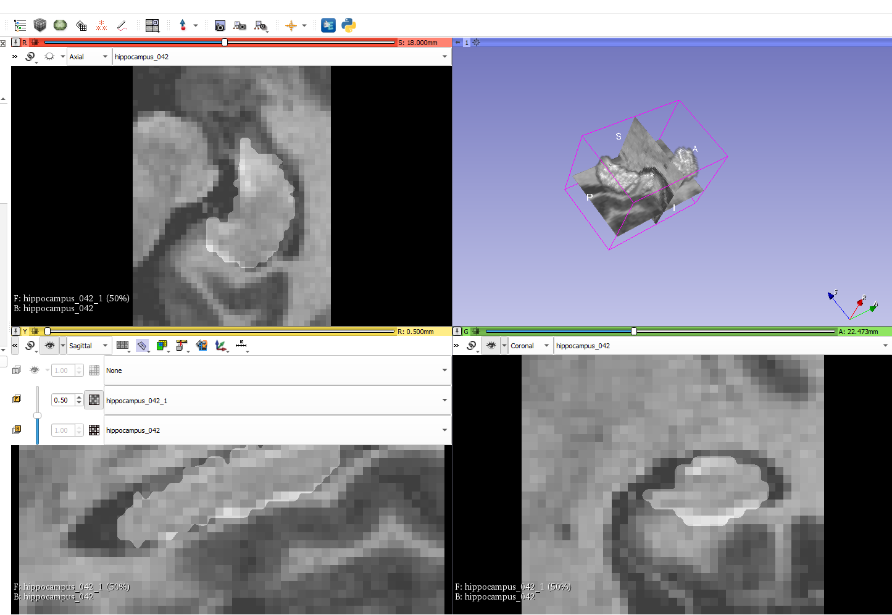
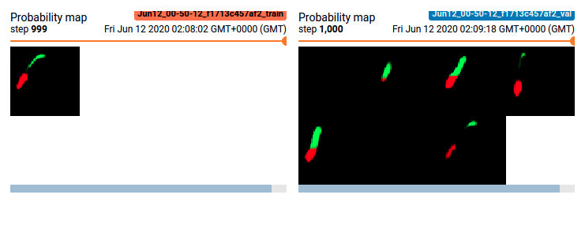

## Project Overview

In this project we built an end-to-end AI system which features a machine learning algorithm that integrates into a clinical-grade viewer and automatically measures hippocampal volumes of new patients, as their studies are committed to the clinical imaging archive.

## Dataset

We are using the "Hippocampus" dataset from the [Medical Decathlon competition](http://medicaldecathlon.com/). This dataset is stored as a collection of NIFTI files, with one file per volume, and one file per corresponding segmentation mask. The original images here are T2 MRI scans of the full brain. As noted, in this dataset we are using cropped volumes where only the region around the hippocampus has been cut out. This makes the size of our dataset quite a bit smaller, our machine learning problem a bit simpler and allows us to have reasonable training times. You should not think of it as "toy" problem, though. Algorithms that crop rectangular regions of interest are quite common in medical imaging. Segmentation is still hard.

## The Programming Environment

You will have two options for the environment to use throughout this project:

### Local Environment

Python 3.7+ environment with the following libraries for the first two sections of the project:

* nibabel
* matplotlib
* numpy
* pydicom
* PIL
* json
* torch (preferably with CUDA)
* tensorboard

In the 3rd section of the project we will be working with three software products for emulating the clinical network. 

* [Orthanc server](https://www.orthanc-server.com/download.php) for PACS emulation
* [OHIF zero-footprint web viewer](https://docs.ohif.org/development/getting-started.html) for viewing images. Note that if you deploy OHIF from its github repository, at the moment of writing the repo includes a yarn script (`orthanc:up`) where it downloads and runs the Orthanc server from a Docker container. If that works for you, you won't need to install Orthanc separately.
* If you are using Orthanc (or other DICOMWeb server), you will need to configure OHIF to read data from your server. OHIF has instructions for this: https://docs.ohif.org/configuring/data-source.html
* In order to fully emulate the Udacity workspace, you will also need to configure Orthanc for auto-routing of studies to automatically direct them to your AI algorithm. For this you will need to take the script that you can find at `section3/src/deploy_scripts/route_dicoms.lua` and install it to Orthanc as explained on this page: https://book.orthanc-server.com/users/lua.html
* [DCMTK tools](https://dcmtk.org/) for testing and emulating a modality. Note that if you are running a Linux distribution, you might be able to install dcmtk directly from the package manager (e.g. `apt-get install dcmtk` in Ubuntu)

## Project Instructions

### Section 1: Curating a dataset of Brain MRIs

In the project directory called `section1` is a Python Notebook that contains the EDA of our dataset.
- **[./section1/Final_Project_EDA.ipynb](./section1/Final_Project_EDA.ipynb):** Jupyter notebook containing the EDA of the dataset

### Section 2: Training a segmentation CNN

In the directory called `section2/src` stores the pipeline of our algorithm.
- **[./section2/src/run_ml_pipeline.py](./section2/src/run_ml_pipeline.py):** pipeline
- **[./section2/src/data_prep/HippocampusDatasetLoader.py](./section2/src/data_prep/HippocampusDatasetLoader.py):** Module loads the hippocampus dataset into RAM
- **[./section2/src/data_prep/SlicesDataset.py](./section2/src/data_prep/SlicesDataset.py):** Module for Pytorch dataset representations
- **[./section2/src/experiments/UNetExperiment.py](./section2/src/experiments/UNetExperiment.py):** Module represents a UNet experiment and contains a class that handles the experiment lifecycle
- **[./section2/src/inference/UNetInferenceAgent.py](./section2/src/inference/UNetInferenceAgent.py):** Contains class that runs inferencing
- **[./section2/src/networks/RecursiveUNet.py](./section2/src/networks/RecursiveUNet.py):** Network
- **[./section2/src/utils/utils.py](./section2/src/utils/utils.py):** Helper functions
- **[./section2/src/networks/volume_stats.py](./section2/src/networks/volume_stats.py):** Contains various functions for computing statistics over 3D volumes

### Section 3: Integrating into a clinical network

In this final section we used what we have done in Section 2 to create an AI product that can be integrated into a clinical network and provide the auto-computed information on the hippocampal volume to the clinicians. 

Specifically, we have the following software in this setup:

* MRI scanner is represented by a script `section3/src/deploy_scripts/send_volume.sh`. When you run this script it will simulate what happens after a radiological exam is complete, and send a volume to the clinical PACS. Note that scanners typically send entire studies to archives.
* PACS server is represented by [Orthanc](http://orthanc-server.com/) deployment that is listening to DICOM DIMSE requests on port 4242. Orthanc also has a DicomWeb interface that is exposed at port 8042, prefix /dicom-web. There is no authentication and you are welcome to explore either one of the mechanisms of access using a tool like curl or Postman. Our PACS server is also running an auto-routing module that sends a copy of everything it receives to an AI server. See instructions ad the end of this page on how to launch if you are using the Udacity Workspace.  
* Viewer system is represented by [OHIF](http://ohif.org/). It is connecting to the Orthanc server using DicomWeb and is serving a web application on port 3000. Again, see instructions at the end of this page if you are using the Udacity Workspace.
* AI server is represented by a couple of scripts. `section3/src/deploy_scripts/start_listener.sh` brings up a DCMTK's `storescp` and configures it to just copy everything it receives into a directory that you will need to specify by editing this script, organizing studies as one folder per study. HippoVolume.AI is the AI module that you will create in this section.

- **[./section3/src/inference_dcm.py](./section3/src/inference_dcm.py):** It contains code that will analyze the directory of the AI server that contains the routed studies, will generate report, and push it back to our PACS.
- **[./section3/arc/deploy_scripts/send_volume.sh](./section3/src/deploy_scripts/send_volume.sh):** Test the algorithm by running this file

## Results

